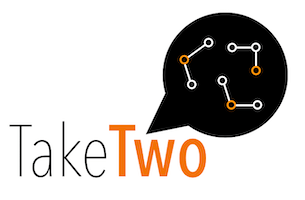
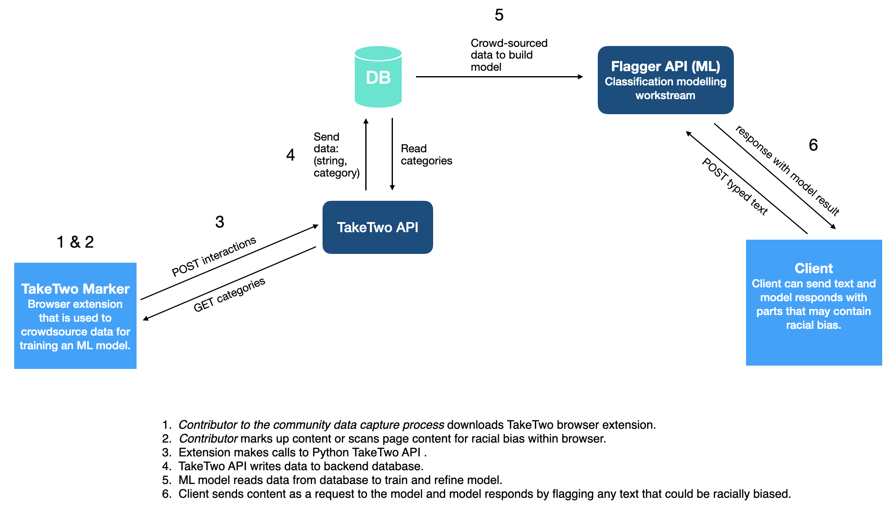

# TakeTwo Solution Starter
TakeTwo provides a quick and simple tool to help detect and eliminate racial bias -- both overt and subtle -- in written content. This can assist content creators in proactively mitigating potential biases as they write. It can also be used by people to review written content on websites and social media for potential biases.

TakeTwo detects phrases and words that could be seen as racially biased as you are developing content and helps you take responsibility for what you say.

## Contents

1. [Overview](#overview)
2. [Video](#video)
3. [The idea](#the-idea)
4. [How it works](#how-it-works)
5. [Diagrams](#diagrams)
6. [Documents](#documents)
7. [Datasets](#datasets)
8. [Technology](#technology)
9. [Getting started](#getting-started)
10. [Disclosures](#disclosures)
11. [License](#license)

[TakeTwo Website](https://w3.ibm.com/w3publisher/take-two)

## Overview

### What's the problem?

#### Emb(race): Diverse Representation

Technology has the power to drive action. And right now, a call to action is needed to eradicate racism. **Black lives matter.**

We recognize technology alone cannot fix hundreds of years of racial injustice and inequality, but when we put it in the hands of the Black community and their supporters, technology can begin to bridge a gap. To start a dialogue. To identify areas where technology can help pave a road to progress.

This is one of several open source projects underway as part of the [Call for Code for Racial Justice](https://github.com/topics/embrace-call-for-code) led by contributors from IBM and Red Hat.

*Bias is learned and perpetuated in different ways (e.g. societal beliefs, misrepresentation, ignorance) that consequently create inequitable outcomes across all spheres of life.*

This repository is part of the [Embrace: Diverse Representation](https://github.com/Call-for-Code/Embrace-Diverse-Representation) stream and our focus is on problem statement 3. We decided to focus on the following two predefined hills:

1. A media content editor (e.g., audio, gaming, movies, tv, comics, news, publications) can incorporate bias detection and remediation into their creative process to reduce racial bias and improve representation to Gen Z.

2. A social media user can understand the historical and societal context of racial bias and cultural appropriation reflected in their posts in real time.

We have identified the following issues currently faced by **content platforms**:

- Racially biased content created due to lack of context and information.
- The possibility to perpetuate bias through content.
- Offensive and hurtful language that can cause others pain.

This project aims to facilitate **content platforms** to:

- Flag words and phrases that may contain racial bias.
- Categorize the type of racial bias that may be present.
- Amend text to reduce the possibility of posting offensive content.
- Become more aware and improve representation in their future content.
- Become a more inclusive platform.

## Video

[TakeTwo Video (Password Needed)](https://vimeo.com/453093788)

## The Idea

The TakeTwo solution provides a quick and simple tool for **content platforms** to detect and eliminate racial bias (both overt and subtle) from their content.

## How it Works

### What is TakeTwo?
TakeTwo is an API that can be used in your development of text content or code to scan for potentially racially biased language. The API works by flagging and classifying phrases and words that have a tendency of being perceived as racially biased within the United States. See the [categories for commonly detectable types of racially biased language](#datasets) below.

### How does TakeTwo work?
TakeTwo leverages a crowd-sourced database of words and phrases that could be viewed as racially biased in the US. Verified, trusted contributors can use TakeTwo's browser extension to select potentially biased language in text-based media. These selections are classified under commonly detected types of racially biased language to train TakeTwo's text-classification machine learning model.  

TakeTwo's machine learning model is used to help identify subtle, context-dependent phrases or words that may be perceived as racially biased in the United States.

Users of the API and browser extension can provide feedback on the value of the recommendations provided so that the AI model can be steadily improved and refined over-time.

This API is underpinned by a crowd-sourced database of words and phrases that are deemed racially biased. These phrases are categorized in order to train an AI model on the significance of the context in which the language was used. Contributors to the project can be part of the crowdsourcing process by installing a browser extension. This API repo is part of the data capture process, which is used for modeling.

There are a number of other repositories related to this project:

- [TakeTwo Data Science](datascience/README.md) - Contains data science work for building and training the model.
- [TakeTwo Marker Chrome Extenstion](chromeextension/README.md) - Code for the Chrome extension used to crowdsource data for training the ML model.

## Technology

TakeTwo is built using open source technologies. The API is built using Python, [FastAPI](https://fastapi.tiangolo.com/), and [Docker](https://www.docker.com) (if running on a Kubernetes cluster).

The data is sent to a backend database. The code is set up to be able to run the API locally with a [CouchDB](https://couchdb.apache.org/) backend database or [IBM Cloudant](https://www.ibm.com/cloud/cloudant) database.

To run with CouchDB, you will need to deploy a CouchDB docker image either locally or on a Kubernetes cluster.

There is a front-end HTML page that serves and example text editor.

## Diagrams

### TakeTwo Architecture

This API (highlighted in the following diagram) is part of the Call For Code TakeTwo Project. This API is used to capture the data highlighted by users through the TakeTwo Chrome extension tool.

 

## Datasets

This project has defined a number of data scheme categories of racial bias, which are used by a text classification model (outlined below), however we welcome feedback on these categories.

#### Common types of detectable racially biased language

- Appropriation - **Definition:** To adopt or claim elements of one or more cultures to which you do not belong, consequently causing offence to members of said culture(s) or otherwise achieving some sort of personal gain at the expense of other members of the culture(s).
- Stereotyping - **Definition:** To perpetuate a system of beliefs about superficial characteristics of members of a given ethnic group or nationality, their status, society and cultural norms.
- Under-Representation - **Definition:** To have insufficient or disproportionately low representation of Black, Indigenous, People of Color (BIPOC) individuals, for example in mediums such as media and TV adverts.
- Gaslighting - **Definition:** To use tactics, whether by a person or entity, in order to gain more power by making a victim question their reality.  To deny or refuse to see racial bias, which may also include the act of convincing a person that an event, slur, or idea is not racist or not as bad as one claims it to be through means of psychological manipulation.
- Racial Slur - **Definition:** To insult, or use offensive or hurtful language designed to degrade a person because of their race or culture. This is intentional use of words or phrases to speak of or to members of ethnic groups in a derogatory manor.
- Othering - **Definition:** To label and define a person or group as someone who belongs to a "socially subordinate" category of society. The practice of othering persons means to use the characteristics of a person's race to exclude and displace such person from the 'superior' social group and separate them from what is classed as normal.

## Getting started

#### TakeTwo Web Backend API

The Web API is build in Python and handles the following:
- Capture the data crowdsourced by contributors through the [TakeTwo Chrome extension tool](chromeextension/README.md).
- Capture the data highlighted by contributors and posts it to a backend database. Separately, this data will be used to train a [ML model](datascience/README.md) that can detect racial bias.
- Fetch the defined categories of racial bias and serve them in the extension tool.

[Follow these instructions for setting up the web back end API](webapi/README.md)

#### TakeTwo Browser Extension

The TakeTwo Chrome javascript extension uses the [Highlighter chrome extension](https://github.com/jeromepl/highlighter) library as a basis in order to allow the highlighter functionality for selecting text.

The TakeTwo Chrome browser extension is a plugin to facilitate the capture and categorization words and phrases that could be racially biased through a browser. The words and phrases can be categorized.

This extension is used to enable the crowdsourcing of data for use in training an ML model. This extension aims to make it as easy as possible for community members who would like to contribute to this initiative to do so quickly and privately.

#### TakeTwo Data Science

The TakeTwo Data Science workstream uses data crowdsourced by a [Chrome extension](chromeextension/README.md) and sent to a [backend database](webapi/README.md).

The machine learning model code is written in Python and runs in a Jupyter notebook.

[Follow these instructions for building a machine learning model to predict whether a word or phrase contains racial bias](datascience/README.md)

### Contributing

We welcome contributions! For details on how to contributing please read the [CONTRIBUTING](CONTRIBUTING.md) file in this repo.

This project is still very much a work in progress, however our hope for the future is that this is a step towards a more informed media culture that is more aware of racial bias in media content. We hope this can be built out so that it can be used in a range of areas; news, social media, forums, code etc.

We also hope to expand the project to enable detection of racial bias in audio and video in the future.

We hope you will help us in this open source community effort!

## Authors

- User Researcher: Anna Rodriguez
- Designers: Naagma Timakondu, Sbusiso Mkhombe
- Tester: Merlina Escorcia
- Generalist: Ashley West, Jashu Gorsia, Yolanda Rabun
- Data Scientists: Naoki Abe, Alayt Issak
- Lead Developer: Johanna Saladas
- Architect: Steve Uniack
- Offering Manager: Iain McCombe

## Documents

[Media Representations Impact Black Men](https://www.opportunityagenda.org/explore/resources-publications/media-representations-impact-black-men/media-portrayals)

## Disclosures

## License

This solution starter is made available under the [MIT License](LICENSE).
