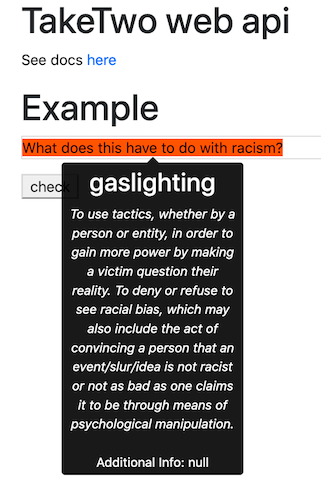
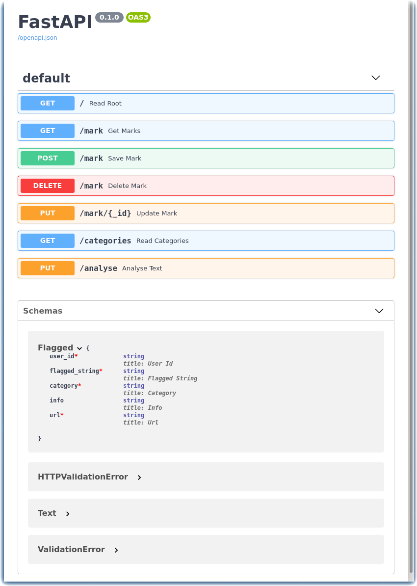

# TakeTwo Solution Starter
TakeTwo provides a quick and simple tool to help detect and eliminate racial bias -- both overt and subtle -- in written content. This can assist content creators in proactively mitigating potential biases as they write. It can also be used by people to review written content on websites and social media for potential biases.

## Contents

1. [Overview](#overview)
2. [Video](#video)
3. [The idea](#the-idea)
4. [How it works](#how-it-works)
5. [Diagrams](#diagrams)
6. [Documents](#documents)
7. [Datasets](#datasets)
8. [Technology](#technology)
9. [Getting started](#getting-started)
10. [Disclosures](#disclosures)
11. [License](#license)


[TakeTwo Website](https://w3.ibm.com/w3publisher/take-two)

## Overview

### What's the problem?
#### Emb(race): Diverse Representation

Technology has the power to drive action. And right now, a call to action is needed to eradicate racism. **Black lives matter.**

We recognize technology alone cannot fix hundreds of years of racial injustice and inequality, but when we put it in the hands of the Black community and their supporters, technology can begin to bridge a gap. To start a dialogue. To identify areas where technology can help pave a road to progress.

This is one of several open source projects underway as part of the [Call for Code for Racial Justice](https://github.com/topics/embrace-call-for-code) led by contributors from IBM and Red Hat.

*Bias is learned and perpetuated in different ways (e.g. societal beliefs, misrepresentation, ignorance) that consequently create inequitable outcomes across all spheres of life.*

This repository is part of the [Embrace: Diverse Representation](https://github.com/Call-for-Code/Embrace-Diverse-Representation) stream and our focus is on problem statement 3. We decided to focus on the following two predefined hills:

1. A media content editor (e.g., audio, gaming, movies, tv, comics, news, publications) can incorporate bias detection and remediation into their creative process to reduce racial bias and improve representation to Gen Z.

2. A social media user can understand the historical and societal context of racial bias and cultural appropriation reflected in their posts in real time.

We have identified the following issues currently faced by **content platforms**:

- Racially biased content created due to lack of context and information.
- The possibility to perpetuate bias through content.
- Offensive and hurtful language that can cause others pain.

This project aims to facilitate **content platforms** to:

- Flag words and phrases that may contain racial bias.
- Categorize the type of racial bias that may be present.
- Amend text to reduce the possibility of posting offensive content.
- Become more aware and improve representation in their future content.
- Become a more inclusive platform.

## Video

[TakeTwo Video (Password Needed)](https://vimeo.com/453093788)


## The Idea

The TakeTwo solution provides a quick and simple tool for **content platforms** to detect and eliminate racial bias (both overt and subtle) from their content.

## How it Works

This API is underpinned by a crowd-sourced database of words and phrases that are deemed racially biased. These phrases are categorized in order to train an AI model on the significance of the context in which the language was used. Contributors to the project can be part of the crowdsourcing process by installing a browser extension. This API repo is part of the data capture process, which is used for modelling.

There are a number of other repositories related to this project:

- [TakeTwo Data Science](https://github.com/embrace-call-for-code/taketwo-datascience) - Contains data science work for building and training the model.
- [TakeTwo Marker Chrome Extenstion](https://github.com/embrace-call-for-code/taketwo-marker-chromeextension) - Code for the Chrome extension used to crowdsource data for training the ML model.


## Technology

TakeTwo is built using open source technologies. The API is built using Python, [FastAPI](https://fastapi.tiangolo.com/), and [Docker](https://www.docker.com) (if running on a Kubernetes cluster).

The data is sent to a backend database. The code is set up to be able to run the API locally with a [CouchDB](https://couchdb.apache.org/) backend database or [IBM Cloudant](https://www.ibm.com/uk-en/cloud/cloudant) database.

To run with CouchDB, you will need to deploy a CouchDB docker image either locally or on a Kubernetes cluster.

There is a front-end HTML page that serves and example text editor.

## Diagrams
### TakeTwo Architecture

This API (highlighted in the following diagram) is part of the Call For Code TakeTwo Project. This API is used to capture the data highlighted by users through the TakeTwo Chrome extension tool.


</br>

### Description of TakeTwo API

This API is part of the Call For Code TakeTwo project. This API is used to capture the data crowdsourced by our contributors through the [Take 2 Chrome extension tool](https://github.com/embrace-call-for-code/taketwo-marker-chromeextension).

The API is used to fetch the defined categories of racial bias and serve them in the extension tool. It also captures the data highlighted by contributors and posts it to a backend database. This data is used to train an [ML model](https://github.com/embrace-call-for-code/taketwo-datascience) that can detect racial bias.

## Datasets

The database contains the following fields:

- ``"_id"``: Database field (optional)
- ``"_rev"``: Database field
- ``"user_id"``: *The user ID*
- ``"flagged_string"``: *The word of phrase that has been highlighted by the user.*
- ``"category"``: *The category that has been selected for the type of racial bias present in the highlighted word or phrase.*
- ``"info"``: *Additional information, context description provided by the user.* (optional)
- ``"url"``: *The url from where the word or phrase was highlighted.*


</br>

This project has defined a number of categories of racial bias, which are used by a text classification model (outlined below), however we welcome feedback on these:

- Appropriation
- Stereotyping
- Under-Representation
- Gaslighting
- Racial Slur
- Othering

Definitions of these categories can be found on the TakeTwo webpage.

</br>

## Getting started

#### Clone the TakeTwo repository

To run this API locally you will need to clone this repo.

```git clone https://github.com/embrace-call-for-code/taketwo-webapi.git```

#### Install the Python prerequisites

Navigate into the repo:

```cd taketwo-webapi```

Run the following command to create a virtual environment:

```python3 -m venv env```

Activate virtual environment:

```source env/bin/activate```

Install the packages needed from the requirements.txt file:

```pip install -r requirements.txt```

Navigate to the folder which contains the API code:

```cd taketwo-webapi```

#### Start a CouchDB container
Before launching the application, set the name of your CouchDB database.

```export DBNAME=taketwodatabase```

To run the API with a CouchDB backend, start a couchDB container before running the main.py code.

```docker run -p 5984:5984 -d -e COUCHDB_USER=admin -e COUCHDB_PASSWORD=password couchdb```

#### Launch the application

Run the Python api code:

```uvicorn main:app --reload```

</br>

### Deploy to Kubernetes

There is already an [image](https://hub.docker.com/repository/docker/josiemundi/taketwo_v0.1) available in Docker hub for this API, which you can use to deploy to a Kubernetes cluster. Alternatively you can build your own using the Dockerfile in this repo. To build a new image, run the following command in a terminal window:

```docker build -t <dockerusername>/taketwo_api .```

To push the image to Docker hub, run the following:

```docker push <dockerusername>/taketwo_api```

</br>

### Use the API

When the API is running, the main url will show an example text editor, which can be used to make requests to the backend data. You can type in the text box and then press check. Text that could be racially biased will be highlighted as shown in the following example.

Open a browser to [http://localhost:8000](http://localhost:8000)

</br>



### Review the TakeTwo OpenAPI documentation

For an overview of the available endpoints navigate to [http://localhost:8000/docs](http://localhost:8000/docs)



### Contributing

We welcome contributions! For details on how to contributing please read the [CONTRIBUTING](CONTRIBUTING.md) file in this repo.

This project is still very much a work in progress, however our hope for the future is that this is a step towards a more informed media culture that is more aware of racial bias in media content. We hope this can be built out so that it can be used in a range of areas; news, social media, forums, code etc.

We also hope to expand the project to enable detection of racial bias in audio and video in the future.

We hope you will help us in this open source community effort!

## Authors

- User Researcher: Anna Rodriguez
- Designers: Naagma Timakondu, Sbusiso Mkhombe
- Tester: Merlina Escorcia
- Generalist: Ashley West, Jashu Gorsia, Yolanda Rabun
- Data Scientists: Naoki Abe, Alayt Issak
- Lead Developer: Johanna Saladas
- Architect: Steve Uniack
- Offering Manager: Iain McCombe

## Documents

[Media Representations Impact Black Men](https://www.opportunityagenda.org/explore/resources-publications/media-representations-impact-black-men/media-portrayals)

## Disclosures

## License

This solution starter is made available under the [MIT License](LICENSE).
